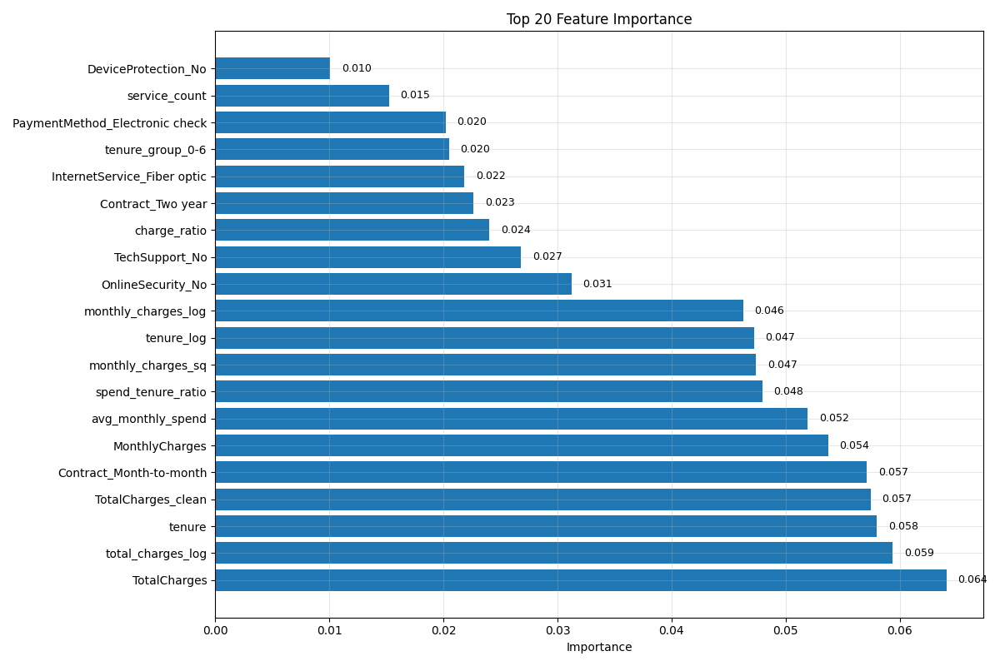

# Feature Descriptions

This document provides detailed descriptions of all engineered features created by the `AdvancedFeatureEngineer`.

## 1. Tenure Features

### 1.1 `tenure_group`
**Description**: Categorical grouping of customer tenure.
- **Values**: '0-6', '6-12', '12-24', '24-48', '48-72'
- **Purpose**: Captures non-linear effects of tenure on churn
- **Business Logic**: New customers (0-6 months) are highest risk

### 1.2 `tenure_risk_score`
**Description**: Numerical risk score based on tenure.
- **Values**: 0-3 (0=Lowest Risk, 3=Highest Risk)
- **Purpose**: Quantifies churn risk from tenure alone
- **Formula**: 
  - 0-6 months: 3 (Very High Risk)
  - 6-12 months: 2 (High Risk)
  - 12-24 months: 1 (Medium Risk)
  - 24-48 months: 0.5 (Low Risk)
  - 48+ months: 0 (Very Low Risk)

### 1.3 `tenure_log`
**Description**: Logarithmic transformation of tenure.
- **Formula**: `log(tenure + 1)`
- **Purpose**: Compresses large values, captures diminishing returns

### 1.4 `senior_tenure`
**Description**: Interaction between Senior Citizen status and tenure.
- **Formula**: `SeniorCitizen * tenure`
- **Purpose**: Senior citizens may have different churn patterns

## 2. Monetary Features

### 2.1 `monthly_charges_log`
**Description**: Logarithmic transformation of monthly charges.
- **Formula**: `log(MonthlyCharges + 1)`
- **Purpose**: Handles skewness and captures non-linear effects

### 2.2 `monthly_charges_sq`
**Description**: Squared monthly charges.
- **Formula**: `MonthlyCharges^2`
- **Purpose**: Captures quadratic relationship with churn

### 2.3 `TotalCharges_clean`
**Description**: Cleaned total charges (handles missing values).
- **Values**: 0 or positive float
- **Purpose**: Safe handling of missing values

### 2.4 `total_charges_log`
**Description**: Logarithmic transformation of total charges.
- **Formula**: `log(TotalCharges_clean + 1)`
- **Purpose**: Normalizes skewed distribution

### 2.5 `avg_monthly_spend`
**Description**: Average monthly spend over tenure.
- **Formula**: `TotalCharges / tenure` (or `MonthlyCharges` if tenure=0)
- **Purpose**: More stable measure than total charges

### 2.6 `charge_ratio`
**Description**: Ratio of monthly to total charges.
- **Formula**: `MonthlyCharges / TotalCharges`
- **Purpose**: Indicates billing intensity and patterns

## 3. Service Features

### 3.1 `service_count`
**Description**: Total number of services subscribed.
- **Formula**: Count of services excluding 'No' and 'No internet service'
- **Purpose**: Measures product adoption breadth
- **Range**: 0-10 (depends on services available)

### 3.2 `additional_services`
**Description**: Number of services beyond minimum.
- **Formula**: `service_count - min(service_count)`
- **Purpose**: Captures upsell and cross-sell potential

### 3.3 `internet_service_count`
**Description**: Count of internet-related services.
- **Services**: InternetService, OnlineSecurity, OnlineBackup, DeviceProtection, TechSupport, StreamingTV, StreamingMovies
- **Purpose**: Measures digital service adoption

### 3.4 `has_multiple_services`
**Description**: Binary indicator for multiple services.
- **Values**: 0 (Single service), 1 (Multiple services)
- **Purpose**: Identifies customers with bundle potential

### 3.5 `is_fully_bundled`
**Description**: Indicator for full service adoption.
- **Values**: 0 (Not fully bundled), 1 (Fully bundled)
- **Purpose**: Identifies highest-value customers

## 4. Interaction Features

### 4.1 `contract_duration_months`
**Description**: Contract length in months.
- **Values**: 1 (Month-to-month), 12 (One year), 24 (Two year)
- **Purpose**: Standardizes contract types

### 4.2 `tenure_contract_ratio`
**Description**: Ratio of tenure to contract duration.
- **Formula**: `tenure / contract_duration_months`
- **Purpose**: Indicates contract lifecycle stage
- **Interpretation**: 
  - < 1: Within initial contract
  - = 1: Contract end
  - > 1: Post-contract

### 4.3 `autopay_tenure`
**Description**: Interaction between autopay and tenure.
- **Formula**: `has_autopay * tenure`
- **Purpose**: Autopay customers may have different loyalty patterns

### 4.4 `senior_service_count`
**Description**: Senior citizens with service count.
- **Formula**: `SeniorCitizen * service_count`
- **Purpose**: Senior customers' service adoption patterns

## 5. Risk Indicators

### 5.1 `risk_score`
**Description**: Composite risk score from multiple factors.
- **Formula**: Sum of risk factors (0-5)
- **Risk Factors**: Short tenure, High charges, Month-to-month contract, No security, Electronic check
- **Interpretation**: Higher score = Higher churn risk

### 5.2 `risk_level`
**Description**: Categorical risk level.
- **Values**: 'Low', 'Medium', 'High'
- **Based on**: `risk_score`
  - 0-1: Low
  - 2-3: Medium
  - 4-5: High

### 5.3 `has_family`
**Description**: Customer with dependents or partner.
- **Values**: 0 (No family), 1 (Has family)
- **Purpose**: Family customers may be more loyal

### 5.4 `is_paperless`
**Description**: Paperless billing indicator.
- **Values**: 0 (No), 1 (Yes)
- **Purpose**: Paperless billing often correlates with digital engagement

## Feature Importance Ranking

## Business Impact

These features enable:
- **Early churn detection** (tenure risk, tenure_contract_ratio)
- **Customer segmentation** (service_count, risk_level)
- **Revenue optimization** (avg_monthly_spend, charge_ratio)
- **Retention targeting** (risk_score, has_family)
